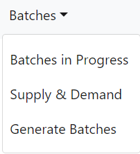

# Reservoir
Reservoir is a tool used by a few internal Revature teams to assist with training planning. Users can retrieve information about the current talent pool, ongoing trainings, and upcoming client demand. Reservoir assists long-term planning by providing hypothetical training schedules built to meet future demand. C-levels using Reservoir can mark trainings as confirmed and specify a trainer.

The Reservoir project is a full-stack web application. The front end is built using JavaScript with React as a framework, while the back end uses Microservice architecture, built with Maven and Java Spring. See below for further details.

## Back End
The back end of Reservoir is responsible for retrieving and altering data in a relational database, generating reports which describe hypothetical training schedules based on client demand and available associates, and sending data via HTTP responses depending on received requests. The back end uses Microservice architecture built using Eureka, Zuul, and Feign.

### Built With
* [Spring Framework](https://spring.io/) - back end framework
* [Maven](https://maven.apache.org/) - dependency management
* [JUnit](https://junit.org/junit5/) - unit testing
* [Spring Cloud](https://github.com/spring-cloud/spring-cloud-netflix) - microservice architecture
  * Eureka - service registry
  * Zuul - gateway
  * Feign Client - HTTP client

### Services
* Data Service - responsible for communicating with the RDS to retrieve and alter data about batches, associates, clients, trainers, skill sets, and more using Spring Data JPA and Hibernate. Also responsible for setting up RESTful endpoints using Spring Web.
* Reports Service - retrieves information from the Data Service and generates potential future batches based on client demand and available associates. **This section could be expanded**
* SQS Service - receives incoming data from an SQS and adds it to the database. **This section could be expanded**
* Registry Service - creates the Microservice Service Registry using Eureka.
* Gateway Service - creates a routing gateway using Zuul.

### Data Service
The Data Service communicates with the RDS using Hibernate as an ORM. The data models that Hibernate uses are: *Associate, Batch, Client, ClientDemand, Consent, Curriculum, Location, Skills, Skillset,* and *Trainer*. Each model has a service and repository for retrieving the data from the database based on specific criteria, as well as a controller which receives HTTP requests and directs them to the appropriate endpoint. For example, sending a GET request to the endpoint "/batches/date/{yyyy-mm-dd}" will return any batches where the provided date falls in between their start date and end date. The front end uses these endpoints to get data to be displayed for the user. It will also send PATCH requests which modify the data, such as adding associates or trainers to a batch. The Reports service will also access these endpoints using a Feign client.

### Reports Service
*Insert further details about how the reports service works*

### SQS Service
The SQS Service receives messages in a standard queue from other parts of Revature. The SQS Service manipulates the messages it receives in order to modify the database used by Reservoir. Currently, the SQS Service can add, update, and delete on **Batches, Skills, Associates, and Trainers** depending on the message received. All the messages received are JSON, and have key value pairs for *objectType*, *requestType*, and *values*. The *objectType* is a string that specifies the object that will be passed in. The *values* are the objects contained in an array. The *requestType* is a string that determines which CRUD operation to perform in our SQS Service. It should be noted that *Read* is not an option provided by this service (look into data service or report service).

### Testing
*Insert information about unit testing*

## Front End
The front end of Reservoir is a single-page application which can display batch data, assign trainers and associates to batches, create consent requests for trainers being assigned to a batch, and generate potential batches based on associate availability and client demand. See "Usage" section for details.

### Built With
* [React](https://reactjs.org/) - front end framework / library for building user interfaces
* [Redux](https://redux.js.org/) - application state manager
* [Reactstrap](https://reactstrap.github.io/) - pre-built, styled components for React using Bootstrap

### Usage (**This section will probably need to be adjusted based on the final product**)
#### Navbar 
The user can use the navigation bar at the top of the application to navigate to every view detailed below.

#### In Progress (/in-progress)
This will lead the user to a view which displays information all the batches currently in progress, as well as all future batches. By default, this is a table, but this can be switched to a calendar view at any time. Clicking on "Set Filters" will bring up a form which will allow the user to filter out batches based on Program Type, Client, and Curriculum.

Clicking "view" will bring up more information about the batch, including its status, associates, and trainers. This view will also allow the user to add and remove trainers to and from the batch, as well set the batch's status to "confirmed".

In the calendar view, the batches are sorted by location, and the calendar can be navigated to view the full time interval of each batch. Right clicking on the batch will show more information, while double clicking on the batch will allow the user to edit it, as above.

#### Demand Overview (/overview-demand)
This page provides an overview of client demand associated with a particular skillset. Depending on the skillset selected, it generates a graph which shows the total number of associates demanded as well as the number of associates available immediately, in one month, and in three months.

#### Training Overview (/overview-training)
This page allows the user to generate scenarios about possible batch placements based on client demand and available associates. **When this page is finished, this should have a fuller explanation**

#### Trainer Assignment (/trainer-assign)
This page allows the user to view all available trainers and assign them to a batch with a curriculum corresponding to their skillset. If the user wants to assign the trainer to a batch whose curriculum does not correspond to their skillset, the user can instead create a consent request, which the trainer can accept or deny. **Again, this could use more detail when the page is finished**

#### Consent Requests (/consent-requests)
**(not sure exactly what will be here)**

#### Generate Batch (/BatchPage)
**(again, someone else should probably fill in the details)**

# Contributors
[List of Contributors](./contributors.md)

# Acknowledgements
* Thank you to Adam King for teaching us and helping us so much throughout this whole process.
* Thanks to our fearless team leads, Mark Alsip, Dan Brown, and Nick Steen, for taking charge and guiding us.
* Thank you, Revature, for giving us this opportunity.